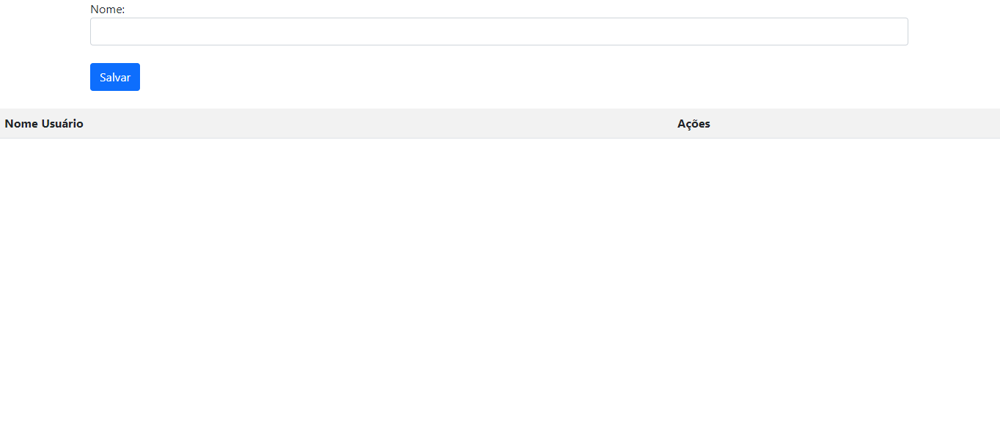

# login2.html
Projeto de contrução de login com redirecionamento de página utilizado linguagem Javascript, 
da disciplina de Progamação web I, do professor Leonardo.
Nesse projeto entendemos como utilizar javascript para 
redirecionar página html bem como compreendemos a
utilização de laços de repetição utilizado for, também
com a mesma linguagem.
 

  